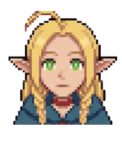

<div align="center">


# Marcille — Desktop Character Companion 🧝‍♀️

**An animated character who lives on your desktop.**

</div>

Marcille is a desktop **character companion** — think of her like a Hatsune-Miku-style virtual character, but one who actually hangs out on your screen. She's [Marcille Donato](https://en.wikipedia.org/wiki/Delicious_in_Dungeon) from *Delicious in Dungeon*: she wanders around, blinks, naps, reacts to your cursor, talks back in character, plays your music, runs little errands, and remembers you over time.

She runs **fully on your own machine** — no account needed for the basics.

<div align="center">



<br/>
<sub>She has 22 expressions and reacts to what you're doing.</sub>
</div>

---

## ⚡ Quick start

### What you need
**Just [Python](https://www.python.org/downloads/) (3.10 or newer)** — that's the one program required. On Windows, tick **"Add Python to PATH"** in the installer.

### Steps
1. **Download the project** — green **Code** button → **Download ZIP** → extract. (Or `git clone`.)
2. **Install the one dependency:**
   ```
   pip install pillow
   ```
3. **Run her:**
   - **Windows:** double-click **`Start Marcille.bat`** (or run `python marcille.py`)
   - **Linux / macOS:** `python3 marcille.py` (or `bash start_marcille.sh`)

Right-click her for the menu. Press **Esc** to quit.

> **Which file do I run?** → **`marcille.py`** is the app. The `.bat`/`.sh` files are just convenience launchers.

---

## 💻 Platforms

| Platform | Status |
|----------|--------|
| **Windows 10 / 11** | ✅ Fully supported — everything works |
| **Linux** | 🧪 Experimental — she runs, but see the note below |
| **macOS** | 🧪 Experimental — should run, less tested |

**Linux/macOS note:** The character, animations, dragging, moods, chatter and music keys work cross-platform. A few Windows extras (idle detection, active-window awareness, media keys, lock-screen) use optional helper tools on Linux — install them for the full experience:
```
sudo apt install xprintidle xdotool playerctl   # Debian/Ubuntu
```
**One real limitation on Linux:** Marcille's clean "cutout" transparency is a Windows/macOS feature. On Linux she looks best under a **compositing window manager** (GNOME, KDE, Picom, etc.); without one she'll appear on a flat colored backdrop instead of a clean cutout. This is a known limitation, not a bug.

---

## 📦 Do I need the whole project?

**Yes — download/clone all of it.** She needs `marcille.py` **and** the `assets/` folder (her sprites live there). She won't run without the assets.

Not included (the `.gitignore` skips them — they're large or personal, and only the optional advanced features need them): the Python virtual env (`rvc_env/`), downloaded AI/voice model weights, and your personal state files (config, memory, caches). The core companion works without any of these.

---

## 🔧 Dependencies

### Required
| What | How |
|------|-----|
| **Python 3.10+** | https://www.python.org/downloads/ |
| **Pillow** | `pip install pillow` |
| **tkinter** | Bundled with Python on Windows/macOS. On Linux: `sudo apt install python3-tk` |

The base companion — animation, dragging, moods, music keys, reminders, text-to-speech — needs **nothing beyond Pillow**.

### Optional add-ons
| Feature | Install |
|---------|---------|
| 🗣️ Nicer TTS voice | `pip install edge-tts` |
| 🎵 Spotify control | `pip install spotipy` (+ your Spotify credentials) |
| 🎤 Wake-word + voice commands ("Marcille…") | `pip install vosk sounddevice numpy faster-whisper` (+ a Vosk model) |
| 🧠 Local AI brain (chat / sees screen / does tasks) | [Ollama](https://ollama.com) with `gemma3:4b` + `qwen2.5:7b` — offline & free |
| ☁️ Smarter cloud brain | A Google **Gemini** API key in your config (falls back to local) |
| 🎙️ Custom Miku-style RVC voice | `torch` + the RVC env (heavy; see `miku_rvc.py`) |

Grab everything optional at once:
```
pip install pillow edge-tts spotipy vosk sounddevice numpy faster-whisper
```

---

## 🎮 Using her

- **Right-click** → menu (music, tasks, voice, "what you remember", size…)
- **Drag** her around (she'll complain — she's a dignified mage)
- **Talk to her** if voice is on — say **"Marcille"** then your command
- **Esc** → quit

---

## 📜 Credits

Art/sprite credits in [`CREDITS.txt`](CREDITS.txt). Marcille Donato is a character from *Delicious in Dungeon* (Ryōko Kui); this is a non-commercial fan project.
